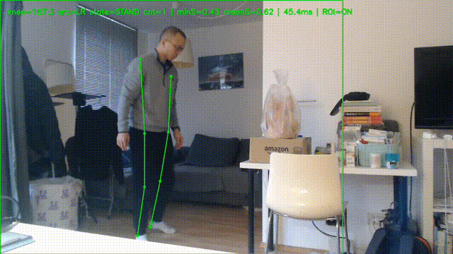

# NukaMotion

**Motion-based wake-up system.  
No buttons. No cheating. Just move.**

> *Passwords prove identity. Motion proves wakefulness.*

---

## 🧠 What is NukaMotion?

**NukaMotion** is an experimental wake-up system that requires **physical movement**
(e.g. squats) to unlock an alarm.

Instead of tapping a button half-asleep, you must **prove that you are awake** —
with your body.

The system uses **real-time human pose estimation** to detect squats and
only disables the alarm after valid movements are completed.

---

## 🚀 Why NukaMotion?

Traditional alarms are easy to silence and easy to regret.

NukaMotion is built on a simple idea:

> **If your body is moving, you are awake.**

By enforcing motion as a wake-up condition, NukaMotion:
- Prevents unconscious snoozing
- Forces blood flow and muscle activation
- Creates a short but effective *wake-up ritual*

---

## 🎥 Demo

NukaMotion supports a debug/demo mode with:
- Real-time skeleton overlay
- Knee angle visualization
- Squat count and state
- Optional recorded output video (`debug_out.mp4`)

Designed to be **demo-friendly** and **presentation-ready**.



---

## 🏗 System Overview

**Hardware**
- NVIDIA Jetson (CPU-first, GPU planned)
- USB camera (side-view recommended)

**Software**
- MoveNet (SinglePose, Lightning)
- TFLite Runtime (CPU)
- OpenCV + GStreamer
- Python-based motion logic & state machine

**Core pipeline**
```
Camera
  → Pose Estimation
    → Knee Angle Analysis
      → Squat State Machine
        → Alarm Unlock
```

---

## 🏃 How Squats Are Detected

- Side-view human pose is tracked using MoveNet
- Knee joint angle is calculated from hip–knee–ankle keypoints
- A state machine detects:
  - `STAND → DOWN → STAND`
- Each valid cycle counts as **one squat**
- The alarm unlocks after **N squats**

To improve robustness:
- ROI tracking stabilizes pose detection
- Automatic fallback to full-frame detection handles tracking loss
- Temporal smoothing reduces jitter

---

## ⚠️ Current Limitations

- Single-person only
- Side-view works best (by design)
- CPU inference (~10–13 FPS)
- Experimental prototype, not a consumer product

---

## 🔮 Future Work

- GPU acceleration with TensorRT
- Multi-pose support
- Audio alarm integration
- Configurable motion types (jump, plank, etc.)
- Embedded / edge deployment

---

## 🧪 Project Status

This project is part of **Nuka Lab** — a personal experimental lab focused on:

- Human–machine interaction
- Edge AI & perception
- Behavior-driven system design

NukaMotion is an **exploration**, not a finished product.

---

## 🧾 License

MIT License (or project-specific license)

---

**Wake up.  
Move.  
Unlock.**
